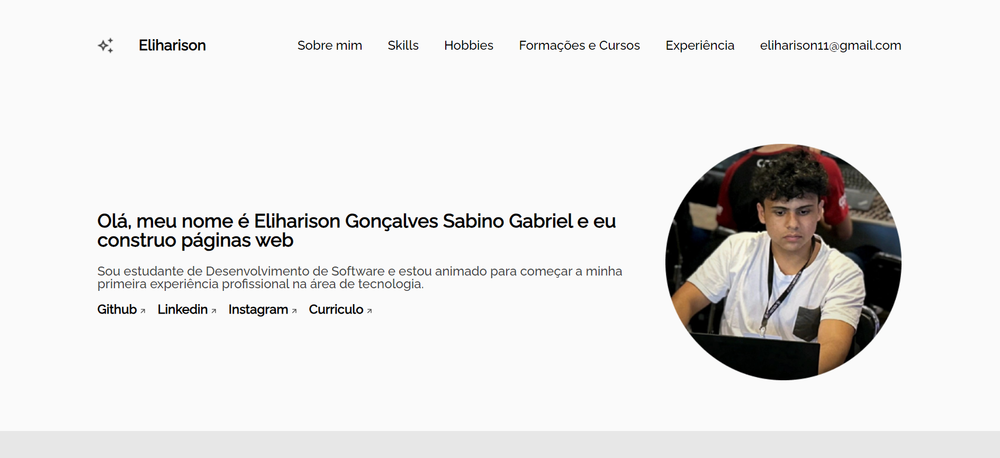

# Challenge ONE | Front End - Portfólio
---

### Este é o repositório que utilizou como base o [Repositório da Alura-chalenges](https://github.com/alura-challenges/challenge-one-portfolio-br), nele voce encontrará:
#### 🔹index.html: Documento HTML finalizado que você pode utilizar em seu projeto. Fonte, CSS e JavaScript já linkado e todas as sessões comentadas. Sinta-se a vontade para executar o seu próprio HTML caso deseje;
#### 🔹style.css: Documento de CSS com instruções de estilo e também algumas sugestões para seu desenvolvimento
#### 🔹validacao.js: Documento vazio para que possa aplicar sua lógica de programação, trabalhando com a validação de formulário em JavaScript
#### Ao clonar, ou realizar o download do projeto base, você tera essa apresentação:

     

---

### Agora, além de Ajustar como o projeto base, eu fui Além!
Desenvolvi meu próprio Portfólio!

     

### Skills Aprendidas
- Validação de formulários
- Utilização BEM para CSS
- Utilização de FlexBox e Flex-Itens

#### Estou muito feliz por ter um projeto tão legal de desenvolver e espero me surpreender cada vez mais com essa especialização Alura- ONE!!